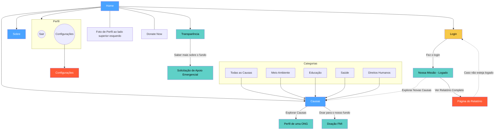

```mermaid
flowchart TD

    %% Categorias
    subgraph Categorias
        TC["Todas as Causas"]
        MA["Meio Ambiente"]
        ED["Educação"]
        SA["Saúde"]
        DH["Direitos Humanos"]
    end

    %% Páginas principais
    Home["Home"]
    Sobre["Sobre"]
    Causas["Causas"]
    Transparencia["Transparência"]
    Login["Login"]

    %% Menu usuário
    subgraph Perfil
        Sair(("Sair"))
        Config(("Configurações"))
    end

    ConfigPage["Configurações"]

    %% Fluxo inicial
    Home --> Sobre
    Home --> Causas
    Home --> Transparencia
    Home --> Login

    Home --> Perfil
    Config --> ConfigPage

    %% Categorias -> Causas
    TC --> Causas
    MA --> Causas
    ED --> Causas
    SA --> Causas
    DH --> Causas

    %% Exploração de causas
    Causas -- "Explorar Causas" --> PerfilONG["Perfil de uma ONG"]

    Causas -- "Doar para o nosso fundo" --> DoacaoFMI["Doação FMI"]

    %% Transparência
    Transparencia -- "Saber mais sobre o fundo" --> Apoio["Solicitação de Apoio Emergencial"]

    %% Login
    Login -- "Fez o login" --> Missao["Nossa Missão - Logado"]

    Missao -- "Ver Relatório Completo" --> Relatorio["Página do Relatório"]

    %% Navegação adicional
    Missao -. "Explorar Novas Causas" .-> Causas

    %% Fluxo não autenticado
    Relatorio -. "Caso não esteja logado" .-> Login

    %% Observações
    Note1["Foto de Perfil ao lado superior esquerdo"]
    Note2["Donate Now"]

    Home --- Note1
    Home --- Note2

    %% Status de implementação
    classDef naoImplementado fill:#ff5a36,color:#fff;
    classDef poucoImplementado fill:#f7c948,color:#000;
    classDef parcial fill:#5fd0c7,color:#000;
    classDef completo fill:#4aa3ff,color:#fff;

    class ConfigPage,Relatorio naoImplementado;
    class Login poucoImplementado;
    class Transparencia,PerfilONG,DoacaoFMI,Missao,Apoio parcial;
    class Home,Sobre,Causas completo;

```